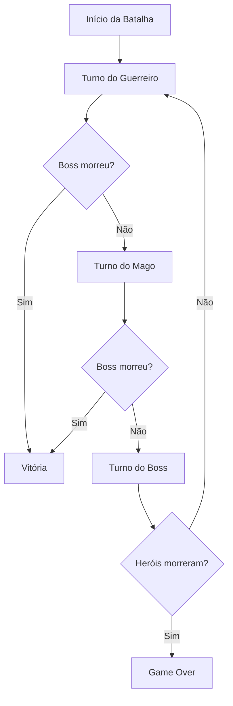

```mermaid
flowchart TD

A[Início da Batalha] --> B[Turno do Guerreiro]
B --> C{Boss morreu?}

C -->|Sim| D[Vitória]
C -->|Não| E[Turno do Mago]

E --> F{Boss morreu?}

F -->|Sim| D
F -->|Não| G[Turno do Boss]

G --> H{Heróis morreram?}

H -->|Sim| I[Game Over]
H -->|Não| B
```

